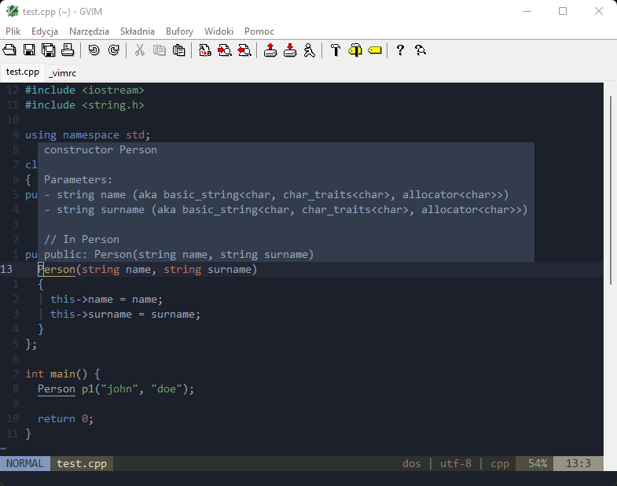

# How it looks like

# How to install
* Install `Visual Studio 2022` (required for YouCompleteMe): https://visualstudio.microsoft.com/pl/vs/community/
* Install `cmake`: https://cmake.org/download/
* Install `python3`: https://www.python.org/downloads/
* Install gvim: https://www.vim.org/download.php
* `git clone https://github.com/dudekmichal/gvimrc`
* Copy vimrc and vimfiles to ~/
* Run gvim, execute command `:PlugInstall`
* In vimfiles/plugged/YouCompleteMe:
`python install.py --clangd-completer --msvc=17`

# Tips
* `:terminal` run internal terminal
* `<leader>hp` show hunk preview (gitgutter)
* `<leader>u` toggle undo tree
* `grep -Rnwi . -e 'sth'` search recursively in current directory
